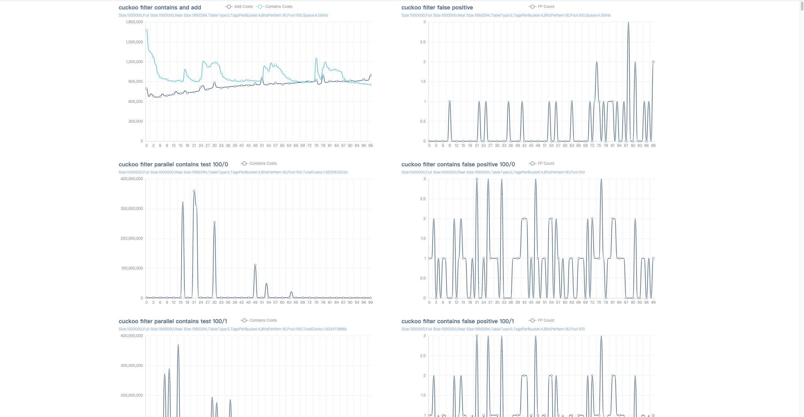

# cuckoo-efficiency

用于给[github.com/linvon/cuckoo-filter](https://github.com/linvon/cuckoo-filter)提供更多的数据支持

## 功能1 布谷鸟过滤器计算器

计算假阳性概率、指纹长度检查、计算项均摊成本、半排序桶占用成本检查

```
init...
init success
b:  2  f:  16  α:  0.84
计算假阳性概率 2b/2^f< r
0.00006103515625

指纹长度检查
计算指纹应保证 "f ≥ log_2(2b/r)=log_2(1/r) + log_2(2b)"
fingerprint 16 >= 16 && 16 == 16 is ok

计算项均摊成本
计算每个项的均摊成本应保证 "C ≤ [log_2(1/r) + log_2(2b)]/α"
C 每个项均摊成本: "C ≤ 19.047619047619047"

半排序桶占用成本检查
使用半排序时，应保证 "ceil(b*(f-1)/8)<ceil(b*f/8)" 否则是否使用半排序占用的空间是一样大的
半排序桶 4 < 4 is not ok

过滤器大小选择
过滤器的桶总大小一定是 2 的指数倍，因此在设定过滤器大小时，尽量满足 size/α ~=(<) 2^n，size 即为
想要一个过滤器存储的数据量，必要时应选择小一点的过滤器，使用多个过滤器达到目标效果
幂的次数I: 1  2的I次幂:  2 got: 2976190.476190476 近似值:  1.344
幂的次数I: 2  2的I次幂:  4 got: 2976190.476190476 近似值:  2.688
幂的次数I: 3  2的I次幂:  8 got: 2976190.476190476 近似值:  5.376
幂的次数I: 4  2的I次幂:  16 got: 2976190.476190476 近似值:  10.752
幂的次数I: 5  2的I次幂:  32 got: 2976190.476190476 近似值:  21.504
幂的次数I: 6  2的I次幂:  64 got: 2976190.476190476 近似值:  43.008
幂的次数I: 7  2的I次幂:  128 got: 2976190.476190476 近似值:  86.016
幂的次数I: 8  2的I次幂:  256 got: 2976190.476190476 近似值:  172.032
幂的次数I: 9  2的I次幂:  512 got: 2976190.476190476 近似值:  344.064
幂的次数I: 10  2的I次幂:  1024 got: 2976190.476190476 近似值:  688.128
幂的次数I: 11  2的I次幂:  2048 got: 2976190.476190476 近似值:  1376.256
幂的次数I: 12  2的I次幂:  4096 got: 2976190.476190476 近似值:  2752.512
幂的次数I: 13  2的I次幂:  8192 got: 2976190.476190476 近似值:  5505.024
幂的次数I: 14  2的I次幂:  16384 got: 2976190.476190476 近似值:  11010.048
幂的次数I: 15  2的I次幂:  32768 got: 2976190.476190476 近似值:  22020.096
幂的次数I: 16  2的I次幂:  65536 got: 2976190.476190476 近似值:  44040.192
幂的次数I: 17  2的I次幂:  131072 got: 2976190.476190476 近似值:  88080.384
幂的次数I: 18  2的I次幂:  262144 got: 2976190.476190476 近似值:  176160.768
幂的次数I: 19  2的I次幂:  524288 got: 2976190.476190476 近似值:  352321.536
幂的次数I: 20  2的I次幂:  1048576 got: 2976190.476190476 近似值:  704643.072
幂的次数I: 21  2的I次幂:  2097152 got: 2976190.476190476 近似值:  1409286.144
幂的次数I: 22  2的I次幂:  4194304 got: 2976190.476190476 近似值:  2818572.288
幂的次数I: 23  2的I次幂:  8388608 got: 2976190.476190476 近似值:  5637144.576
got: 2.976190476190476e+06  approximation: 5637144.576

```

## 功能2 穷举性能分析

穷举`b=[2,4,8,16]`、`f=[9,32]`一共为96中组合，并输出测试报告

```shell
go test -timeout=100m -v -test.run Test_exhaustion --table-type=0 --size=1000000 --height=10000 --goroutines=100 --loop=1
```

```shell
tree -L 3 test_report_2022-09-02_14:12:07
test_report_2022-09-02_14:12:07
├── cuckoo_filter_size_1000000_full_size_1000000_real_size_1761607_tabletype_0_tagsperbucket_2_bitsperitem_10_.html
├── cuckoo_filter_size_1000000_full_size_1000000_real_size_1761607_tabletype_0_tagsperbucket_2_bitsperitem_11_.html
├── cuckoo_filter_size_1000000_full_size_1000000_real_size_1761607_tabletype_0_tagsperbucket_2_bitsperitem_12_.html
├── cuckoo_filter_size_1000000_full_size_1000000_real_size_1761607_tabletype_0_tagsperbucket_2_bitsperitem_13_.html
├── cuckoo_filter_size_1000000_full_size_1000000_real_size_1761607_tabletype_0_tagsperbucket_2_bitsperitem_14_.html
├── cuckoo_filter_size_1000000_full_size_1000000_real_size_1761607_tabletype_0_tagsperbucket_2_bitsperitem_15_.html
├── cuckoo_filter_size_1000000_full_size_1000000_real_size_1761607_tabletype_0_tagsperbucket_2_bitsperitem_16_.html
├── cuckoo_filter_size_1000000_full_size_1000000_real_size_1761607_tabletype_0_tagsperbucket_2_bitsperitem_17_.html
├── cuckoo_filter_size_1000000_full_size_1000000_real_size_1761607_tabletype_0_tagsperbucket_2_bitsperitem_18_.html
├── cuckoo_filter_size_1000000_full_size_1000000_real_size_1761607_tabletype_0_tagsperbucket_2_bitsperitem_19_.html
├── cuckoo_filter_size_1000000_full_size_1000000_real_size_1761607_tabletype_0_tagsperbucket_2_bitsperitem_20_.html
├── cuckoo_filter_size_1000000_full_size_1000000_real_size_1761607_tabletype_0_tagsperbucket_2_bitsperitem_21_.html
├── cuckoo_filter_size_1000000_full_size_1000000_real_size_1761607_tabletype_0_tagsperbucket_2_bitsperitem_22_.html
├── cuckoo_filter_size_1000000_full_size_1000000_real_size_1761607_tabletype_0_tagsperbucket_2_bitsperitem_23_.html
├── cuckoo_filter_size_1000000_full_size_1000000_real_size_1761607_tabletype_0_tagsperbucket_2_bitsperitem_24_.html
├── cuckoo_filter_size_1000000_full_size_1000000_real_size_1761607_tabletype_0_tagsperbucket_2_bitsperitem_25_.html
├── cuckoo_filter_size_1000000_full_size_1000000_real_size_1761607_tabletype_0_tagsperbucket_2_bitsperitem_26_.html
├── cuckoo_filter_size_1000000_full_size_1000000_real_size_1761607_tabletype_0_tagsperbucket_2_bitsperitem_27_.html
├── cuckoo_filter_size_1000000_full_size_1000000_real_size_1761607_tabletype_0_tagsperbucket_2_bitsperitem_28_.html
├── cuckoo_filter_size_1000000_full_size_1000000_real_size_1761607_tabletype_0_tagsperbucket_2_bitsperitem_29_.html
├── cuckoo_filter_size_1000000_full_size_1000000_real_size_1761607_tabletype_0_tagsperbucket_2_bitsperitem_30_.html
├── cuckoo_filter_size_1000000_full_size_1000000_real_size_1761607_tabletype_0_tagsperbucket_2_bitsperitem_31_.html
├── cuckoo_filter_size_1000000_full_size_1000000_real_size_1761607_tabletype_0_tagsperbucket_2_bitsperitem_32_.html
├── cuckoo_filter_size_1000000_full_size_1000000_real_size_1761607_tabletype_0_tagsperbucket_2_bitsperitem_9_.html
├── cuckoo_filter_size_1000000_full_size_1000000_real_size_1992294_tabletype_0_tagsperbucket_4_bitsperitem_10_.html
├── cuckoo_filter_size_1000000_full_size_1000000_real_size_1992294_tabletype_0_tagsperbucket_4_bitsperitem_11_.html
├── cuckoo_filter_size_1000000_full_size_1000000_real_size_1992294_tabletype_0_tagsperbucket_4_bitsperitem_12_.html
├── cuckoo_filter_size_1000000_full_size_1000000_real_size_1992294_tabletype_0_tagsperbucket_4_bitsperitem_13_.html
├── cuckoo_filter_size_1000000_full_size_1000000_real_size_1992294_tabletype_0_tagsperbucket_4_bitsperitem_14_.html
├── cuckoo_filter_size_1000000_full_size_1000000_real_size_1992294_tabletype_0_tagsperbucket_4_bitsperitem_15_.html
├── cuckoo_filter_size_1000000_full_size_1000000_real_size_1992294_tabletype_0_tagsperbucket_4_bitsperitem_16_.html
├── cuckoo_filter_size_1000000_full_size_1000000_real_size_1992294_tabletype_0_tagsperbucket_4_bitsperitem_17_.html
├── cuckoo_filter_size_1000000_full_size_1000000_real_size_1992294_tabletype_0_tagsperbucket_4_bitsperitem_18_.html
├── cuckoo_filter_size_1000000_full_size_1000000_real_size_1992294_tabletype_0_tagsperbucket_4_bitsperitem_19_.html
├── cuckoo_filter_size_1000000_full_size_1000000_real_size_1992294_tabletype_0_tagsperbucket_4_bitsperitem_20_.html
├── cuckoo_filter_size_1000000_full_size_1000000_real_size_1992294_tabletype_0_tagsperbucket_4_bitsperitem_21_.html
├── cuckoo_filter_size_1000000_full_size_1000000_real_size_1992294_tabletype_0_tagsperbucket_4_bitsperitem_22_.html
├── cuckoo_filter_size_1000000_full_size_1000000_real_size_1992294_tabletype_0_tagsperbucket_4_bitsperitem_23_.html
├── cuckoo_filter_size_1000000_full_size_1000000_real_size_1992294_tabletype_0_tagsperbucket_4_bitsperitem_24_.html
├── cuckoo_filter_size_1000000_full_size_1000000_real_size_1992294_tabletype_0_tagsperbucket_4_bitsperitem_25_.html
├── cuckoo_filter_size_1000000_full_size_1000000_real_size_1992294_tabletype_0_tagsperbucket_4_bitsperitem_26_.html
├── cuckoo_filter_size_1000000_full_size_1000000_real_size_1992294_tabletype_0_tagsperbucket_4_bitsperitem_27_.html
├── cuckoo_filter_size_1000000_full_size_1000000_real_size_1992294_tabletype_0_tagsperbucket_4_bitsperitem_28_.html
├── cuckoo_filter_size_1000000_full_size_1000000_real_size_1992294_tabletype_0_tagsperbucket_4_bitsperitem_29_.html
├── cuckoo_filter_size_1000000_full_size_1000000_real_size_1992294_tabletype_0_tagsperbucket_4_bitsperitem_30_.html
├── cuckoo_filter_size_1000000_full_size_1000000_real_size_1992294_tabletype_0_tagsperbucket_4_bitsperitem_31_.html
├── cuckoo_filter_size_1000000_full_size_1000000_real_size_1992294_tabletype_0_tagsperbucket_4_bitsperitem_32_.html
├── cuckoo_filter_size_1000000_full_size_1000000_real_size_1992294_tabletype_0_tagsperbucket_4_bitsperitem_9_.html
├── cuckoo_filter_size_1000000_full_size_1000000_real_size_2055208_tabletype_0_tagsperbucket_16_bitsperitem_10_.html
├── cuckoo_filter_size_1000000_full_size_1000000_real_size_2055208_tabletype_0_tagsperbucket_16_bitsperitem_11_.html
├── cuckoo_filter_size_1000000_full_size_1000000_real_size_2055208_tabletype_0_tagsperbucket_16_bitsperitem_12_.html
├── cuckoo_filter_size_1000000_full_size_1000000_real_size_2055208_tabletype_0_tagsperbucket_16_bitsperitem_13_.html
├── cuckoo_filter_size_1000000_full_size_1000000_real_size_2055208_tabletype_0_tagsperbucket_16_bitsperitem_14_.html
├── cuckoo_filter_size_1000000_full_size_1000000_real_size_2055208_tabletype_0_tagsperbucket_16_bitsperitem_15_.html
├── cuckoo_filter_size_1000000_full_size_1000000_real_size_2055208_tabletype_0_tagsperbucket_16_bitsperitem_16_.html
├── cuckoo_filter_size_1000000_full_size_1000000_real_size_2055208_tabletype_0_tagsperbucket_16_bitsperitem_17_.html
├── cuckoo_filter_size_1000000_full_size_1000000_real_size_2055208_tabletype_0_tagsperbucket_16_bitsperitem_18_.html
├── cuckoo_filter_size_1000000_full_size_1000000_real_size_2055208_tabletype_0_tagsperbucket_16_bitsperitem_19_.html
├── cuckoo_filter_size_1000000_full_size_1000000_real_size_2055208_tabletype_0_tagsperbucket_16_bitsperitem_20_.html
├── cuckoo_filter_size_1000000_full_size_1000000_real_size_2055208_tabletype_0_tagsperbucket_16_bitsperitem_21_.html
├── cuckoo_filter_size_1000000_full_size_1000000_real_size_2055208_tabletype_0_tagsperbucket_16_bitsperitem_22_.html
├── cuckoo_filter_size_1000000_full_size_1000000_real_size_2055208_tabletype_0_tagsperbucket_16_bitsperitem_23_.html
├── cuckoo_filter_size_1000000_full_size_1000000_real_size_2055208_tabletype_0_tagsperbucket_16_bitsperitem_24_.html
├── cuckoo_filter_size_1000000_full_size_1000000_real_size_2055208_tabletype_0_tagsperbucket_16_bitsperitem_25_.html
├── cuckoo_filter_size_1000000_full_size_1000000_real_size_2055208_tabletype_0_tagsperbucket_16_bitsperitem_26_.html
├── cuckoo_filter_size_1000000_full_size_1000000_real_size_2055208_tabletype_0_tagsperbucket_16_bitsperitem_27_.html
├── cuckoo_filter_size_1000000_full_size_1000000_real_size_2055208_tabletype_0_tagsperbucket_16_bitsperitem_28_.html
├── cuckoo_filter_size_1000000_full_size_1000000_real_size_2055208_tabletype_0_tagsperbucket_16_bitsperitem_29_.html
├── cuckoo_filter_size_1000000_full_size_1000000_real_size_2055208_tabletype_0_tagsperbucket_16_bitsperitem_30_.html
├── cuckoo_filter_size_1000000_full_size_1000000_real_size_2055208_tabletype_0_tagsperbucket_16_bitsperitem_31_.html
├── cuckoo_filter_size_1000000_full_size_1000000_real_size_2055208_tabletype_0_tagsperbucket_16_bitsperitem_32_.html
├── cuckoo_filter_size_1000000_full_size_1000000_real_size_2055208_tabletype_0_tagsperbucket_16_bitsperitem_9_.html
├── cuckoo_filter_size_1000000_full_size_1000000_real_size_2055208_tabletype_0_tagsperbucket_8_bitsperitem_10_.html
├── cuckoo_filter_size_1000000_full_size_1000000_real_size_2055208_tabletype_0_tagsperbucket_8_bitsperitem_11_.html
├── cuckoo_filter_size_1000000_full_size_1000000_real_size_2055208_tabletype_0_tagsperbucket_8_bitsperitem_12_.html
├── cuckoo_filter_size_1000000_full_size_1000000_real_size_2055208_tabletype_0_tagsperbucket_8_bitsperitem_13_.html
├── cuckoo_filter_size_1000000_full_size_1000000_real_size_2055208_tabletype_0_tagsperbucket_8_bitsperitem_14_.html
├── cuckoo_filter_size_1000000_full_size_1000000_real_size_2055208_tabletype_0_tagsperbucket_8_bitsperitem_15_.html
├── cuckoo_filter_size_1000000_full_size_1000000_real_size_2055208_tabletype_0_tagsperbucket_8_bitsperitem_16_.html
├── cuckoo_filter_size_1000000_full_size_1000000_real_size_2055208_tabletype_0_tagsperbucket_8_bitsperitem_17_.html
├── cuckoo_filter_size_1000000_full_size_1000000_real_size_2055208_tabletype_0_tagsperbucket_8_bitsperitem_18_.html
├── cuckoo_filter_size_1000000_full_size_1000000_real_size_2055208_tabletype_0_tagsperbucket_8_bitsperitem_19_.html
├── cuckoo_filter_size_1000000_full_size_1000000_real_size_2055208_tabletype_0_tagsperbucket_8_bitsperitem_20_.html
├── cuckoo_filter_size_1000000_full_size_1000000_real_size_2055208_tabletype_0_tagsperbucket_8_bitsperitem_21_.html
├── cuckoo_filter_size_1000000_full_size_1000000_real_size_2055208_tabletype_0_tagsperbucket_8_bitsperitem_22_.html
├── cuckoo_filter_size_1000000_full_size_1000000_real_size_2055208_tabletype_0_tagsperbucket_8_bitsperitem_23_.html
├── cuckoo_filter_size_1000000_full_size_1000000_real_size_2055208_tabletype_0_tagsperbucket_8_bitsperitem_24_.html
├── cuckoo_filter_size_1000000_full_size_1000000_real_size_2055208_tabletype_0_tagsperbucket_8_bitsperitem_25_.html
├── cuckoo_filter_size_1000000_full_size_1000000_real_size_2055208_tabletype_0_tagsperbucket_8_bitsperitem_26_.html
├── cuckoo_filter_size_1000000_full_size_1000000_real_size_2055208_tabletype_0_tagsperbucket_8_bitsperitem_27_.html
├── cuckoo_filter_size_1000000_full_size_1000000_real_size_2055208_tabletype_0_tagsperbucket_8_bitsperitem_28_.html
├── cuckoo_filter_size_1000000_full_size_1000000_real_size_2055208_tabletype_0_tagsperbucket_8_bitsperitem_29_.html
├── cuckoo_filter_size_1000000_full_size_1000000_real_size_2055208_tabletype_0_tagsperbucket_8_bitsperitem_30_.html
├── cuckoo_filter_size_1000000_full_size_1000000_real_size_2055208_tabletype_0_tagsperbucket_8_bitsperitem_31_.html
├── cuckoo_filter_size_1000000_full_size_1000000_real_size_2055208_tabletype_0_tagsperbucket_8_bitsperitem_32_.html
└── cuckoo_filter_size_1000000_full_size_1000000_real_size_2055208_tabletype_0_tagsperbucket_8_bitsperitem_9_.html

0 directories, 96 files
```

## 功能2 压力测试性能分析

通过传入给定指纹参数`--fingerprint`，对比在`b=[2,4,8,16]`对已满的cuckoo进行压力测试，并输出测试报告
```shell
tree -L 3 test_report_2022-09-02_14:38:08 
test_report_2022-09-02_14:38:08
├── cuckoo_filter_size_1000000_full_size_1000000_real_size_1761607_tabletype_0_tagsperbucket_2_bitsperitem_16_.html
├── cuckoo_filter_size_1000000_full_size_1000000_real_size_1992294_tabletype_0_tagsperbucket_4_bitsperitem_16_.html
├── cuckoo_filter_size_1000000_full_size_1000000_real_size_2055208_tabletype_0_tagsperbucket_16_bitsperitem_16_.html
└── cuckoo_filter_size_1000000_full_size_1000000_real_size_2055208_tabletype_0_tagsperbucket_8_bitsperitem_16_.html

```
```shell
go test -timeout=100m -v -test.run Test_pressure --fingerprint=16 --table-type=0 --size=1000000 --height=10000 --goroutines=100 --loop=100
```


